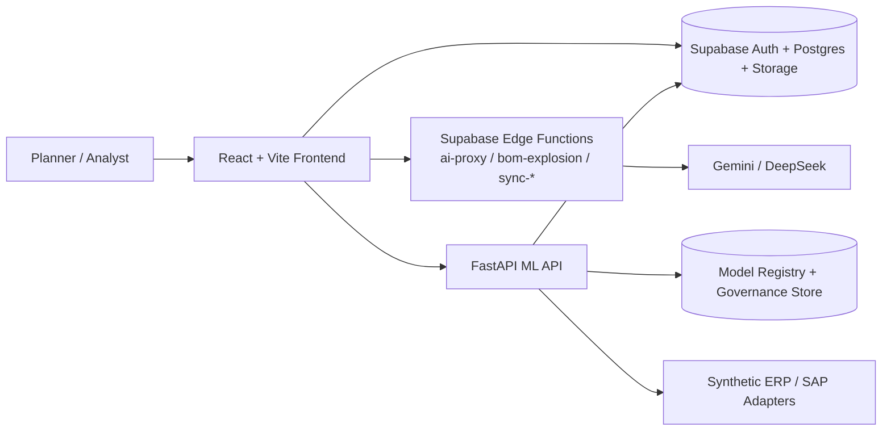

# Decision Intelligence

Decision Intelligence is a chat-first supply chain decision workspace that combines demand forecasting, replenishment planning, risk monitoring, and digital-twin simulation across a React frontend, Supabase services, and a Python ML API.

Current documented baseline: `0.1.0`

- Demo script: [docs/DEMO.md](docs/DEMO.md)
- Architecture: [docs/ARCHITECTURE.md](docs/ARCHITECTURE.md)
- Deployment: [docs/DEPLOYMENT.md](docs/DEPLOYMENT.md)
- Known limitations: [docs/KNOWN_LIMITATIONS.md](docs/KNOWN_LIMITATIONS.md)
- Release notes: [CHANGELOG.md](CHANGELOG.md)
- Chinese product docs: [docs/USER_MANUAL_zh-TW.md](docs/USER_MANUAL_zh-TW.md), [docs/SPECIFICATION_zh-TW.md](docs/SPECIFICATION_zh-TW.md)

## Product Surface

- Command Center for KPI, health, and recent activity.
- Plan Studio for chat-driven data intake, plan generation, and approval flow.
- Forecast Studio for multi-model forecasting and forecast diagnostics.
- Risk Center for supplier and supply risk analysis with what-if views.
- Digital Twin and Scenario Studio for simulation and scenario comparison.
- Governance, audit, async jobs, and regression gates for operational control.

## System Overview



## Demo In 5 Minutes

1. Start the frontend and ML API.
2. Configure `.env.local` from `.env.example`.
3. Log in with a Supabase user.
4. In Plan Studio, upload [public/sample_data/test_data.xlsx](public/sample_data/test_data.xlsx).
5. Walk through `/forecast`, `/risk`, `/digital-twin`, and `/scenarios`.

The detailed walkthrough is in [docs/DEMO.md](docs/DEMO.md).

## Quick Start

Recommended local baseline:

- Node.js `22` for frontend parity with CI
- Python `3.12` for ML API and regression suite
- A Supabase project
- Gemini / DeepSeek keys stored in Supabase Edge Function secrets

Clone the real repository path:

```bash
git clone https://github.com/a8594755-maker/Decision-Intelligence-.git
cd Decision-Intelligence-
```

Start the frontend:

```bash
npm ci
cp .env.example .env.local
npm run dev
```

Start the ML API:

```bash
python3.12 -m venv .venv
source .venv/bin/activate
pip install -r requirements-ml.txt
python run_ml_api.py
```

Default local endpoints:

- Frontend: `http://localhost:5173`
- ML API: `http://127.0.0.1:8000`

Database migrations, Edge Functions, and hosted deployment are documented in [docs/DEPLOYMENT.md](docs/DEPLOYMENT.md).

## Deployment Shape

This repo is currently organized around a three-service topology:

- Frontend: static Vite build on Netlify or another SPA host
- Platform services: Supabase for auth, Postgres, storage, and Edge Functions
- ML backend: Dockerized FastAPI service, with Railway config included in [`railway.toml`](railway.toml)

Operational details are in [docs/DEPLOYMENT.md](docs/DEPLOYMENT.md).

## Testing And Release Discipline

Frontend:

```bash
npm run lint
npm run test:run
npm run build
npm run test:e2e
```

Planning and forecast regression:

```bash
npm run test:regression
```

CI workflows in `.github/workflows/` cover frontend CI, planning and forecast regression, ML CI, guardrails, and release gating. Release notes live in [CHANGELOG.md](CHANGELOG.md).

## Repository Layout

```text
src/                 Frontend application, views, services, and Python ML code
supabase/functions/  Edge Functions for AI proxy, BOM explosion, and sync jobs
sql/migrations/      Curated Supabase SQL migration set
tests/               Frontend, ML, and regression suites
docs/                Product and engineering documentation
sample_data/         Local sample CSV/XLSX assets
public/sample_data/  Bundled demo workbook served by the frontend
```

## Known Limitations

- Full product behavior depends on Supabase, Edge Functions, and the ML API. Frontend-only bring-up is partial.
- Database bootstrap is curated but not yet a single-command install.
- Chronos is excluded from the default Docker image to keep the ML container lean.
- SAP sync functions are integration points, not turnkey ERP connectors.

See [docs/KNOWN_LIMITATIONS.md](docs/KNOWN_LIMITATIONS.md) for the current boundary conditions.

## Documentation Policy

Primary entry documents are kept intentionally small. Historical implementation notes, refactor reports, and agent execution logs are retained under `docs/archive/` for reference, not as the main reading path.

## License

Private repository. No open-source license is granted by default.
