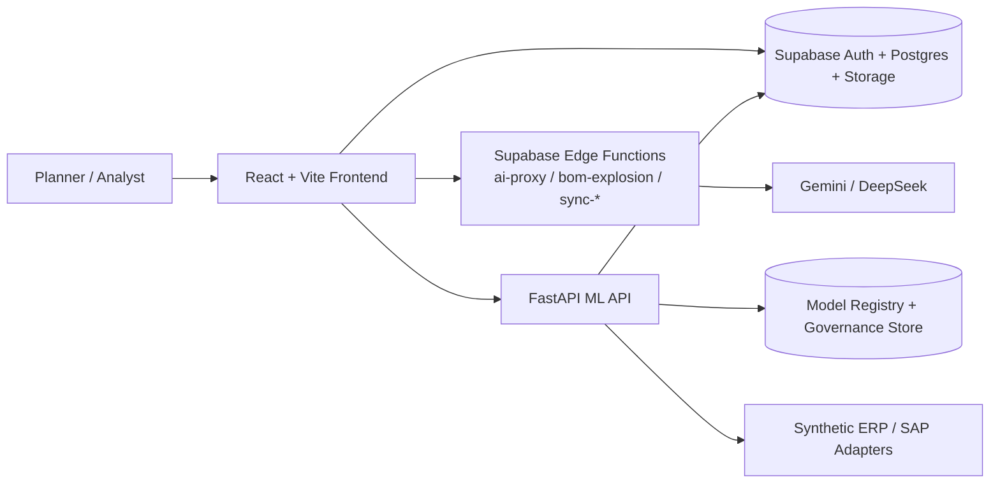

# Decision Intelligence

Decision Intelligence is a chat-first supply chain decision workspace for turning uploaded planning data into forecast diagnostics, replenishment plans, risk review, and scenario decisions.

Built as a multi-service product prototype rather than a single-page CRUD demo.

| Proof point | Evidence |
| --- | --- |
| Product shape | Chat-first planning + forecasting workspace |
| Runtime stack | React + Supabase + FastAPI ML API |
| Engineering signal | Regression-gated repo with demo flow, CI workflows, and in-repo release notes |

<p align="center">
  
</p>

## What You Can Do In 5 Minutes

- Upload the sample workbook in [public/sample_data/test_data.xlsx](public/sample_data/test_data.xlsx).
- Generate a replenishment plan from Plan Studio.
- Inspect forecast diagnostics and demand outputs in Forecast Studio.
- Review supplier risk, digital-twin what-if results, and scenario comparisons.

Follow the guided walkthrough in [docs/DEMO.md](docs/DEMO.md).

## Core Workflows

### 1. Intake and normalize planning data

- Upload workbook or CSV inputs, map fields, and persist operational data through Supabase-backed services.
- Use Plan Studio as the entry point for data readiness, plan generation, inline edits, and approval flow.

### 2. Generate and compare forecasts and plans

- Run forecasting and planning logic through the FastAPI ML service instead of the frontend bundle.
- Review forecast diagnostics, demand artifacts, replenishment outputs, and regression-backed solver behavior.

### 3. Review risk, simulate scenarios, and approve actions

- Explore supplier risk and supply exceptions in Risk Center.
- Use Digital Twin and Scenario Studio to compare outcomes before approving action.

## System Overview



## Fast Path

Recommended local baseline:

- Node.js `22`
- Python `3.12`
- A Supabase project
- Gemini / DeepSeek keys stored in Supabase Edge Function secrets

Start the frontend:

```bash
git clone https://github.com/a8594755-maker/Decision-Intelligence-.git
cd Decision-Intelligence-
npm ci
cp .env.example .env.local
npm run dev
```

Start the ML API:

```bash
python3.12 -m venv .venv
source .venv/bin/activate
pip install -r requirements-ml.txt
python run_ml_api.py
```

Default local endpoints:

- Frontend: `http://localhost:5173`
- ML API: `http://127.0.0.1:8000`

For migrations, Edge Functions, and hosted deployment, use [docs/SETUP.md](docs/SETUP.md) and [docs/DEPLOYMENT.md](docs/DEPLOYMENT.md).

## Engineering Confidence

- Frontend checks cover lint, unit, component, build, and E2E paths.
- Planning and forecast behavior is backed by a deterministic regression suite.
- CI workflows cover frontend CI, ML CI, guardrail checks, and release gating.
- Repository-level release notes are tracked in [CHANGELOG.md](CHANGELOG.md).

Common verification commands:

```bash
npm run lint
npm run test:unit
npm run test:components
npm run build
npm run test:e2e
python -m pytest -q tests/regression
npm run test:phase4-guardrails
```

## Current Status

- Baseline: `0.1.0` as documented on `2026-03-08`
- Scope: working product prototype in a private repository
- Main verified paths: demo flow, planning regression, forecast diagnostics, and core multi-page workspace navigation
- Full behavior boundary: requires the frontend, Supabase, Edge Functions, and the ML API together

## Known Limitations

### Environment dependencies

- Full product behavior depends on Supabase, Edge Functions, and the ML API. Frontend-only bring-up is partial.
- AI workflows require server-side Gemini / DeepSeek secrets plus live network access.
- Some import and async hardening depends on optional migrations in `sql/migrations/`.

### Current scope boundaries

- Environment bootstrap is curated, not yet a single-command full-stack install.
- Chronos-heavy capabilities are excluded from the default ML container image.
- SAP sync functions are adapter entry points, not turnkey enterprise connectors.

See [docs/KNOWN_LIMITATIONS.md](docs/KNOWN_LIMITATIONS.md) for the detailed operating boundary.

## Docs

- Demo script: [docs/DEMO.md](docs/DEMO.md)
- Architecture: [docs/ARCHITECTURE.md](docs/ARCHITECTURE.md)
- Deployment: [docs/DEPLOYMENT.md](docs/DEPLOYMENT.md)
- Known limitations: [docs/KNOWN_LIMITATIONS.md](docs/KNOWN_LIMITATIONS.md)
- Release notes: [CHANGELOG.md](CHANGELOG.md)
- Chinese product docs: [docs/USER_MANUAL_zh-TW.md](docs/USER_MANUAL_zh-TW.md), [docs/SPECIFICATION_zh-TW.md](docs/SPECIFICATION_zh-TW.md)

Historical implementation notes remain under `docs/archive/`, but they are not part of the primary reading path.

Private repository for portfolio / evaluation use. License terms are not published.
