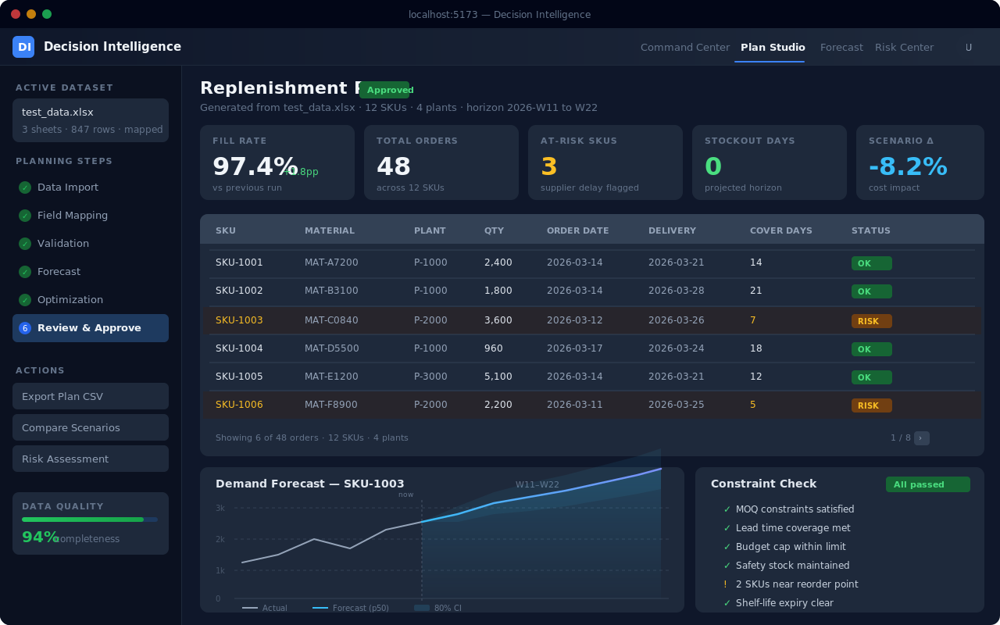
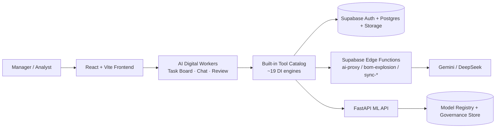

# Decision Intelligence

Decision Intelligence is a Digital Worker platform that deploys managed, auditable digital workers into enterprise operations and analytics workflows.

Each digital worker has a defined role, permission boundaries, available tools, style policies, and escalation rules — operating like a new hire that learns your processes, not a chatbot that answers questions.

| Proof point | Evidence |
| --- | --- |
| Product shape | Digital Worker Platform — task-driven, auditable, role-based |
| v1 beachhead | Analytics Digital Worker (data analysis, forecasting, reporting, risk assessment) |
| Runtime stack | React + Supabase + FastAPI ML API |
| Engineering signal | Regression-gated repo with demo flow, CI workflows, and in-repo release notes |

<p align="center">
  
</p>

## What You Can Do In 5 Minutes

- Assign a task to an AI worker via chat or the task board.
- Watch the worker decompose, execute, and deliver artifacts with full audit trail.
- Review outputs in Canvas, approve or request revisions, and track trust progression.
- Explore built-in domain tools: forecasting, planning, risk analysis, scenario simulation.

Follow the guided walkthrough in [docs/DEMO.md](docs/DEMO.md).

## Core Workflows

### 1. Task intake and decomposition

Workers accept tasks from chat, email, transcripts, scheduled triggers, or proactive signals. Each task is decomposed into executable steps using the built-in tool catalog.

### 2. Autonomous execution with guardrails

Workers execute steps through domain-specific tools (forecast, plan, risk, report, Excel) with capability policies and autonomy levels (A1–A4) governing what requires human review.

### 3. Review, feedback, and trust progression

Managers review deliverables, approve or revise, and the system learns style preferences and adjusts autonomy over time. Full execution timeline is available for audit.

## Fast Path

Recommended local baseline:

- Node.js `22`
- Python `3.12`
- A Supabase project
- Gemini / DeepSeek keys stored in Supabase Edge Function secrets

Start the frontend:

```bash
git clone https://github.com/a8594755-maker/Decision-Intelligence-.git
cd Decision-Intelligence-
npm ci
cp .env.example .env.local
npm run dev
```

Start the ML API:

```bash
python3.12 -m venv .venv
source .venv/bin/activate
pip install -r requirements-ml.txt
python run_ml_api.py
```

Default local endpoints:

- Frontend: `http://localhost:5173`
- ML API: `http://127.0.0.1:8000`

Expected first-success path:

1. Open the frontend at `http://localhost:5173`
2. Navigate to **Digital Workers** and assign a task to the Analytics Worker
3. Follow the walkthrough in [docs/DEMO.md](docs/DEMO.md)

For migrations, Edge Functions, and hosted deployment, see [docs/SETUP.md](docs/SETUP.md) and [docs/DEPLOYMENT.md](docs/DEPLOYMENT.md).

## System Overview



## Engineering Confidence

| Area | Evidence |
| --- | --- |
| Frontend quality | lint, unit, component, build, and E2E checks |
| Planning reliability | deterministic regression suite |
| Agent loop | 12 E2E tests covering chat → decompose → execute → review |
| Delivery discipline | frontend CI, ML CI, guardrail checks, release gating |
| Change history | in-repo release notes in [CHANGELOG.md](CHANGELOG.md) |

Common verification commands:

```bash
npm run lint
npm run test:unit
npm run test:components
npm run build
npm run test:e2e
python -m pytest -q tests/regression
npm run test:phase4-guardrails
```

## Product Scope

**Current baseline**

- `0.1.0` documented on `2026-03-08`
- v1 Digital Worker converged on `2026-03-16` (9-gate audit passed)

**Operating boundary**

- Full behavior requires the frontend, Supabase, Edge Functions, and the ML API together
- Frontend-only bring-up is partial
- SAP sync functions are adapter entry points, not turnkey enterprise connectors

See [docs/KNOWN_LIMITATIONS.md](docs/KNOWN_LIMITATIONS.md) for the detailed operating boundary.

## Docs

- Product Requirements: [docs/DIGITAL_WORKER_PRD_zh-TW.md](docs/DIGITAL_WORKER_PRD_zh-TW.md)
- Gap Analysis: [docs/DIGITAL_WORKER_GAP_ANALYSIS_zh-TW.md](docs/DIGITAL_WORKER_GAP_ANALYSIS_zh-TW.md)
- Demo walkthrough: [docs/DEMO.md](docs/DEMO.md)
- Architecture and request flow: [docs/ARCHITECTURE.md](docs/ARCHITECTURE.md)
- Deployment and environment setup: [docs/DEPLOYMENT.md](docs/DEPLOYMENT.md)
- Operating boundary: [docs/KNOWN_LIMITATIONS.md](docs/KNOWN_LIMITATIONS.md)
- Release notes: [CHANGELOG.md](CHANGELOG.md)
- Full docs index: [docs/README.md](docs/README.md)

This repository is maintained as the reference implementation for the Decision Intelligence Digital Worker Platform.
