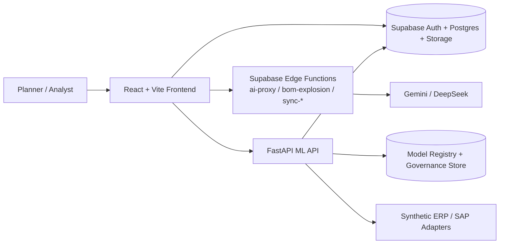

# Decision Intelligence

Decision Intelligence is a chat-first supply chain planning workspace for turning uploaded operational data into forecast diagnostics, replenishment decisions, and scenario review.

It is built as a multi-service product prototype with a React frontend, Supabase platform services, and a FastAPI planning / forecasting backend.

| Proof point | Evidence |
| --- | --- |
| Product shape | Chat-first planning + forecasting workspace |
| Runtime stack | React + Supabase + FastAPI ML API |
| Engineering signal | Regression-gated repo with demo flow, CI workflows, and in-repo release notes |

<p align="center">
  
</p>

## What You Can Do In 5 Minutes

- Load the sample workbook and bootstrap a planning workspace.
- Generate a replenishment plan and review editable planning outputs.
- Inspect forecast diagnostics, demand artifacts, and model-facing results.
- Compare supplier risk and what-if scenarios before approving action.

Follow the guided walkthrough in [docs/DEMO.md](docs/DEMO.md).

## Core Workflows

### 1. Intake and normalize planning data

Upload workbook or CSV inputs, map operational fields, and persist a planning-ready dataset through Supabase-backed services.
Plan Studio acts as the entry point for readiness checks, plan generation, inline edits, and approval flow.

### 2. Generate and compare forecasts and plans

Run forecasting and planning logic through the FastAPI ML service and review diagnostics, demand artifacts, and regression-backed solver outputs.

### 3. Review risk, simulate scenarios, and approve actions

Explore supplier risk and supply exceptions in Risk Center, then use Digital Twin and Scenario Studio to compare outcomes before approving action.

## Fast Path

Recommended local baseline:

- Node.js `22`
- Python `3.12`
- A Supabase project
- Gemini / DeepSeek keys stored in Supabase Edge Function secrets

Start the frontend:

```bash
git clone https://github.com/a8594755-maker/Decision-Intelligence-.git
cd Decision-Intelligence-
npm ci
cp .env.example .env.local
npm run dev
```

Start the ML API:

```bash
python3.12 -m venv .venv
source .venv/bin/activate
pip install -r requirements-ml.txt
python run_ml_api.py
```

Default local endpoints:

- Frontend: `http://localhost:5173`
- ML API: `http://127.0.0.1:8000`

Expected first-success path:

1. Open the frontend at `http://localhost:5173`
2. Upload `public/sample_data/test_data.xlsx`
3. Follow the walkthrough in [docs/DEMO.md](docs/DEMO.md)

For migrations, Edge Functions, and hosted deployment, see [docs/SETUP.md](docs/SETUP.md) and [docs/DEPLOYMENT.md](docs/DEPLOYMENT.md).

## System Overview



## Engineering Confidence

| Area | Evidence |
| --- | --- |
| Frontend quality | lint, unit, component, build, and E2E checks |
| Planning reliability | deterministic regression suite |
| Delivery discipline | frontend CI, ML CI, guardrail checks, release gating |
| Change history | in-repo release notes in [CHANGELOG.md](CHANGELOG.md) |

Common verification commands:

```bash
npm run lint
npm run test:unit
npm run test:components
npm run build
npm run test:e2e
python -m pytest -q tests/regression
npm run test:phase4-guardrails
```

## Prototype Scope

**Current baseline**

- `0.1.0` documented on `2026-03-08`
- Verified on demo flow, planning regression, forecast diagnostics, and core workspace navigation

**Operating boundary**

- Full behavior requires the frontend, Supabase, Edge Functions, and the ML API together
- Frontend-only bring-up is partial
- SAP sync functions are adapter entry points, not turnkey enterprise connectors

See [docs/KNOWN_LIMITATIONS.md](docs/KNOWN_LIMITATIONS.md) for the detailed operating boundary.

## Docs

- Demo walkthrough: [docs/DEMO.md](docs/DEMO.md)
- Architecture and request flow: [docs/ARCHITECTURE.md](docs/ARCHITECTURE.md)
- Deployment and environment setup: [docs/DEPLOYMENT.md](docs/DEPLOYMENT.md)
- Operating boundary: [docs/KNOWN_LIMITATIONS.md](docs/KNOWN_LIMITATIONS.md)
- Release notes: [CHANGELOG.md](CHANGELOG.md)
- Full docs index: [docs/README.md](docs/README.md)

This repository is maintained as a private product prototype for evaluation and portfolio review.
