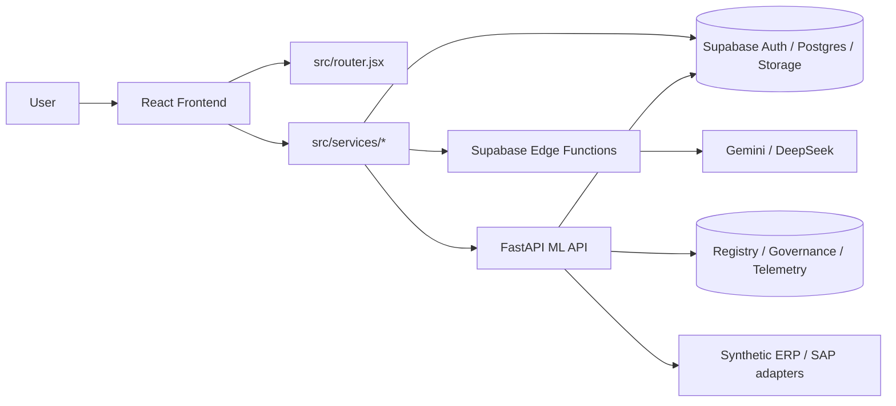

# Architecture

## Runtime Topology

## Layer Responsibilities

| Layer | Responsibility | Main paths |
| --- | --- | --- |
| Frontend shell | Route, layout, page composition | `src/router.jsx`, `src/layouts/`, `src/pages/` |
| View workflows | Plan, forecast, risk, twin, scenario UX | `src/views/`, `src/components/` |
| Frontend services | API adapters, orchestration, client-side contracts | `src/services/` |
| Supabase | Auth, storage, shared operational data | `supabase/`, `sql/migrations/` |
| Edge Functions | AI proxy, BOM explosion, sync jobs | `supabase/functions/` |
| ML API | Forecasting, planning, async jobs, registry, guardrails | `src/ml/api/main.py`, `src/ml/` |
| Quality gates | Regression, CI, release checks | `tests/`, `.github/workflows/` |

## Main Request Flows

### 1. AI-assisted planning

`Browser -> frontend workflow -> ai-proxy / ML API -> Supabase + external model provider -> artifact + UI cards`

- The browser never needs raw Gemini or DeepSeek keys.
- AI calls are centralized in `supabase/functions/ai-proxy/`.
- Planning and forecast execution live in the Python service, not inside the frontend bundle.

### 2. Data intake and operational writes

`Browser -> upload/mapping services -> Supabase RPC or tables -> import history / audit trail`

- Import-related SQL lives in `sql/migrations/` and `database/`.
- Optional migrations unlock better idempotency and async handling.

### 3. Forecasting and optimization

`Frontend -> ML API -> forecasting trainers / solver -> registry + telemetry -> result cards`

- The API entry point is [`src/ml/api/main.py`](../src/ml/api/main.py).
- The Dockerized deployment path is defined in [`../Dockerfile`](../Dockerfile).
- Railway-specific runtime settings live in [`../railway.toml`](../railway.toml).

## Why This Repo Is Split Across Services

- Frontend remains a fast static deploy.
- Supabase handles auth, persistence, storage, and edge execution close to the data plane.
- The ML API keeps solver and model dependencies off the frontend and out of Edge Functions.
- Governance and regression gates can evolve without coupling everything to one runtime.

## Operational Guardrails

- Frontend CI: lint, unit tests, build, E2E
- Planning/forecast regression: deterministic fixture suite
- ML CI: training, drift, orchestration, retrain pipeline checks
- Release gate: regression + artifact + canary evaluation

## Reading Order

1. [../README.md](../README.md)
2. [DEPLOYMENT.md](DEPLOYMENT.md)
3. [KNOWN_LIMITATIONS.md](KNOWN_LIMITATIONS.md)
4. [SPECIFICATION_zh-TW.md](SPECIFICATION_zh-TW.md) if you need full module-level detail
